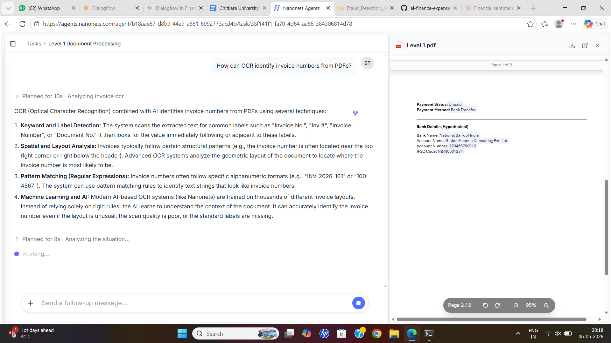
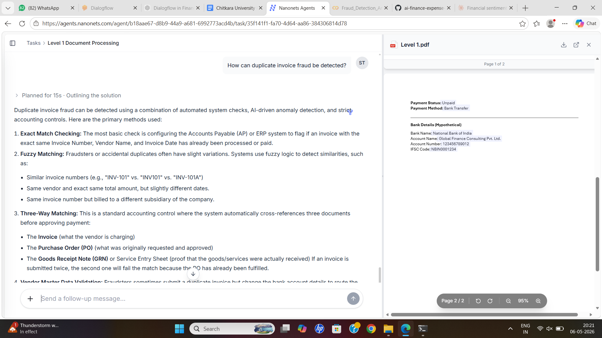
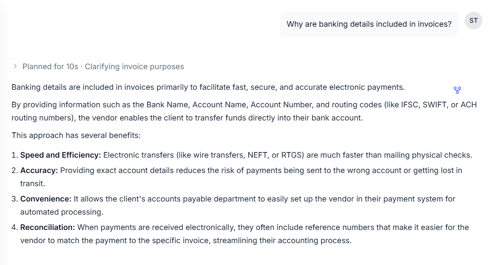
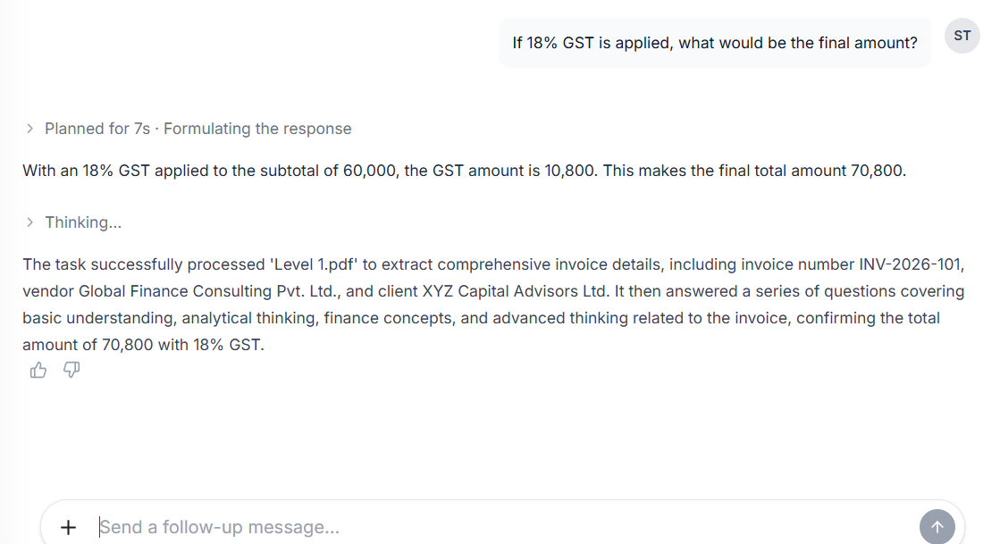
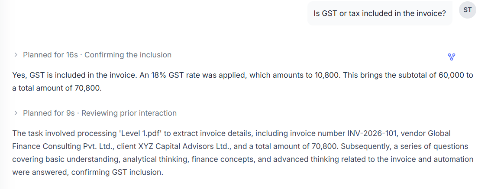

# 🔬 NanoSets Data Automation & Analytics System

## 📌 Project Overview

This project demonstrates an end-to-end **automated data processing and analytics system** designed to efficiently manage structured datasets. It integrates data input, storage, workflow automation, and visualization tools to create a **real-time data tracking and analysis system**.

The solution reduces manual effort, improves data accuracy, and provides instant insights for better decision-making.

---

## 🚨 Business Problem

Traditional data management systems rely heavily on:

* Manual data entry
* Spreadsheet-based tracking
* Unstructured data storage
* Delayed reporting

### ❌ Challenges:

* High chances of errors
* Time-consuming processing
* No real-time insights
* Poor data organization

---

## ✅ Solution

The NanoSets system automates the complete workflow:

1. Data is collected via structured input
2. Stored in organized datasets
3. Automated workflow processes the data
4. System generates outputs/notifications
5. Data is visualized through dashboards

---

## 🛠️ Tools & Technologies

* Google Forms (Data Input)
* Google Sheets (Data Storage)
* n8n (Workflow Automation)
* Python (Optional Data Processing)
* Power BI (Dashboard & Analytics)

---

## 🔄 Workflow Architecture

```text
Data Input → Data Storage → Automation Workflow → Processing → Visualization Dashboard
```

---

## 📁 Project Structure

```text
NanoSets/
│
├── data/
├── workflows/
├── notebooks/
├── screenshots/
│   ├── question_1.png
│   ├── question_2.png
│   ├── question_3.png
│   ├── question_4.png
│   └── question_5.png
│
└── README.md
```

---

## 📸 Screenshots

### 1. Step 1 – Input Interface



---

### 2. Step 2 – Data Storage



---

### 3. Step 3 – Workflow Execution



---

### 4. Step 4 – Processing Output



---

### 5. Step 5 – Final Result / Dashboard



---

## ⭐ Key Features

* Automated data collection
* Structured dataset management
* Workflow-based processing
* Real-time insights generation
* Scalable system design

---

## 📊 Business Impact

* Reduced manual effort and errors
* Faster data processing
* Improved data accuracy
* Better decision-making
* Organized and efficient data flow

---

## 🌍 Real-World Applications

* Financial analytics
* Business intelligence systems
* Data automation workflows
* AI/ML dataset preparation
* Enterprise data management

---

## ⚙️ How to Run the Project

1. Set up a data input source (Form/API)
2. Store data in Google Sheets or CSV
3. Configure n8n workflow automation
4. Process and clean the dataset
5. Connect data to Power BI for visualization

---

## 🚀 Future Enhancements

* AI-based data classification
* Predictive analytics integration
* Real-time alerts and notifications
* Cloud database integration
* Advanced dashboards

---

## 🏁 Conclusion

NanoSets demonstrates how automation and analytics can transform raw data into **real-time actionable insights**, improving efficiency and enabling smarter decision-making.

---

## 👩‍💼 Author

**Shreya Thakkar**
MBA Finance Student | AI & Data Enthusiast
